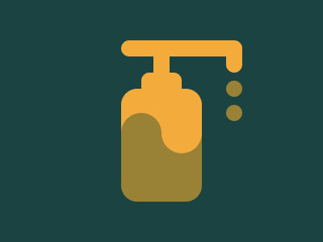

# 50 - USE HAND SANITIZER - 100% MATCH 
#### (NEEDS SERIOUS REWORK)



## NORMAL
```
<body bgColor=#1A4341 style=height:100%;display:grid;place-items:center;margin:0px>
    <div main>
      <p a>
      <a id="drops"></a>
      </p>
      <p b></p>  
      <p c></p>  
      <p d></p>   
      <p e></p>     
    </div>
      
    <style>
      
      * {
        box-sizing: border-box;
      }
      
      div[main] {
        width: 100px;
        display: grid;
        place-items: center;
        position: relative;
      }
      
      p {
        margin: 0px;
        height: 20px;
        background: #F3AC3C;
      }
      
      p[a] {
        width: 150%;
        margin-left: 50px; 
        border-radius: 10px;  
      } 
     
      p[b] {
        width: 20px;
      }
      
      p[c] {
        width: 50px;
        border-radius: 10px 10px 0 0;  
      }
      
      p[d] {
        height: 60px;
        width: 100%;
        border-radius: 20px 20px 0 0;   
      }
    
      p[e] {
        height: 80px;
        width: 100%;
        border-radius: 0 0 20px 20px;
        background: #998235;
      } 
      
      p[e]:before, p[e]:after {
        content: "";
        width: 50px;
        height: 70px;    
        border-radius: 50px;
        position: absolute;
      }
    
      p[e]:before {
        top: 90px;
        background: #998235;
      }
    
      p[e]:after {
        left: 50px;
        top: 70px; 
        background: #F3AC3C;    
      }  
      
      #drops {
        right: -50px;
        height: 40px;
        width: 20px;
        border-radius: 10px;
        background: #F3AC3C;
        display: block;
        position: absolute;
      }  
      
      #drops:before,#drops:after {
        content: "";
        height: 20px;
        width: 20px;
        background: #998235;
        border-radius: 50%;
        position: absolute;    
      }
      
      #drops:before {
        top: 50px;
      }
      
      #drops:after {
        top: 80px;
      }
      
    </style>
```

## MINIFIED

```
<body bgColor=#1A4341 style=height:100%;display:grid;place-items:center;margin:0px><div main><p a><a id="drops"></a></p><p b></p><p c></p><p d></p><p e></p></div><style>*{box-sizing:border-box}div[main]{width:100px;display:grid;place-items:center;position:relative}p{margin:0;height:20px;background:#F3AC3C}p[a]{width:150%;margin-left:50px;border-radius:10px}p[b]{width:20px}p[c]{width:50px;border-radius:10px 10px 0 0}p[d]{height:60px;width:100%;border-radius:20px 20px 0 0}p[e]{height:80px;width:100%;border-radius:0 0 20px 20px;background:#998235}p[e]:before,p[e]:after{content:"";width:50px;height:70px;border-radius:50px;position:absolute}p[e]:before{top:90px;background:#998235}p[e]:after{left:50px;top:70px;background:#F3AC3C}#drops{right:-50px;height:40px;width:20px;border-radius:10px;background:#F3AC3C;display:block;position:absolute}#drops:before,#drops:after{content:"";height:20px;width:20px;background:#998235;border-radius:50%;position:absolute}#drops:before{top:50px}#drops:after{top:80px}</style>
```
