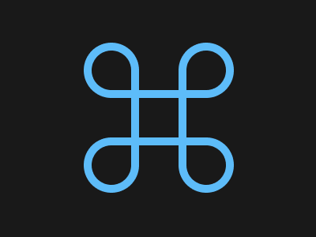

# 63 - COMMAND KEY - 100% MATCH



## NORMAL
```
<body bgColor=#191919 style=margin:0;display:grid>
  <p a><p b><p c><p d>  
<style>
    
* {
  box-sizing: border-box;  
}
  
p {    
  width: 70px;
  height: 190px;
  left: 2px;
  top: -2px;
  bottom: 0;
  right:0;
  margin: auto;
  border: 10px solid #5DBCF9;
  border-left-color: #191919; 
  border-left-width: 9px; 
  mix-blend-mode: lighten;
  border-radius: 50px;
  position: absolute;
}

p[a] {   
  transform: translate(-60px);
}
  
p[b] {   
  transform: rotate(90deg) translate(-60px);
}
  
p[c] {   
  transform: rotate(180deg) translate(-60px);
}
  
p[d] {   
  transform: rotate(-90deg) translate(-60px);
}
```

## MINIFIED

```
<body bgColor=#191919 style=margin:0;display:grid><p a><p b><p c><p d><style>*{box-sizing:border-box}p{width:70;height:190;left:2;top:-2;bottom:0;right:0;margin:auto;border:10px solid #5DBCF9;border-left-color:#191919;border-left-width:9;mix-blend-mode:lighten;border-radius:50px;position:absolute}p[a]{transform:translate(-60px)}p[b]{transform:rotate(90deg) translate(-60px)}p[c]{transform:rotate(180deg) translate(-60px)}p[d]{transform:rotate(-90deg) translate(-60px)}
```
